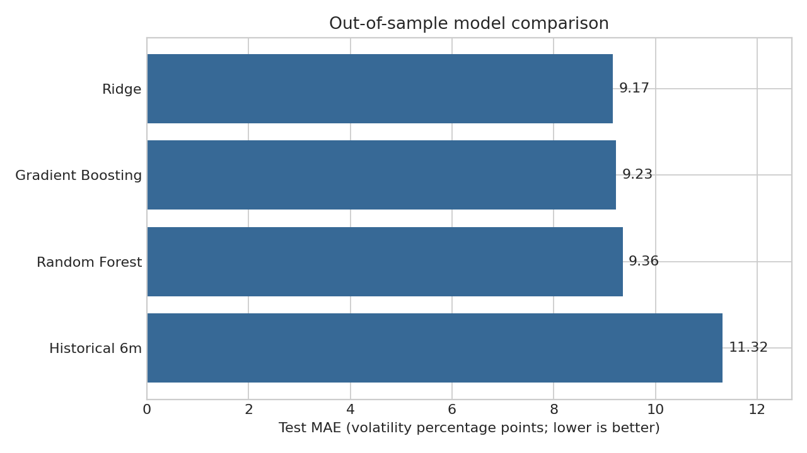
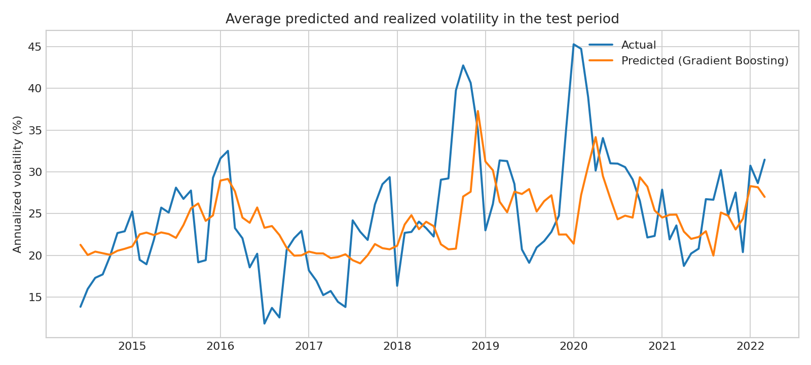
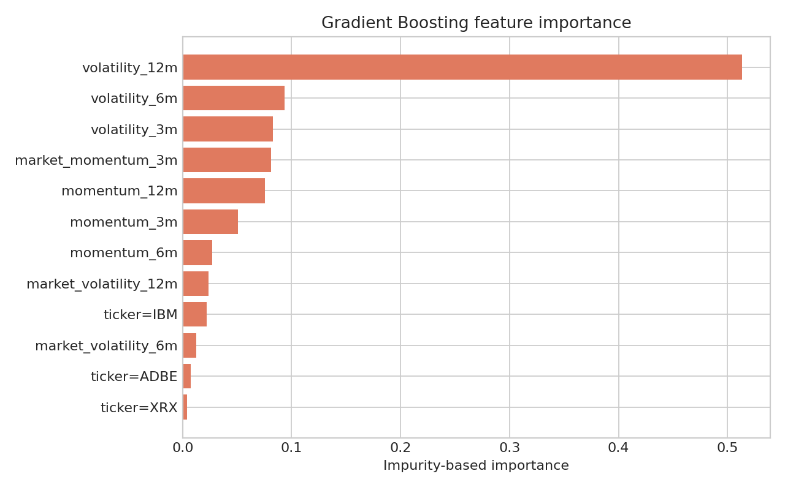

# Forecasting Equity Volatility with Classical Machine Learning

A compact, leakage-aware comparison of three classical machine-learning models
for forecasting equity volatility:

- Ridge regression
- Random Forest
- Gradient Boosting

The goal is not to claim a production-ready trading signal. It is to answer a
clear empirical question:

> Can simple price-based features improve on recent historical volatility when
> forecasting volatility over the next three months?

## Main result

On a final chronological test set from June 2014 to March 2022, every ML model
beats the six-month historical-volatility baseline.

| Model | Test MAE | Test RMSE | Test R² |
|---|---:|---:|---:|
| Ridge | **0.0917** | 0.1242 | 0.0850 |
| Gradient Boosting | 0.0923 | **0.1239** | **0.0899** |
| Random Forest | 0.0936 | 0.1256 | 0.0645 |
| Historical volatility (6m) | 0.1132 | 0.1521 | -0.3708 |

An MAE of `0.0917` means an average error of about **9.17 annualized
volatility percentage points**. Ridge reduces MAE by roughly **19%** relative to
the historical-volatility baseline. Gradient Boosting has the lowest RMSE, so
it is slightly better when large errors receive more weight.



## Data and prediction target

The included dataset is Matplotlib's `Stocks.csv` sample, whose header
attributes the prices to Yahoo Finance. It contains monthly adjusted prices for
eight equities and two US indices from 1990 to 2022. Missing pre-IPO periods and
Dell's private-company period are kept as missing rather than filled.

Each observation is one stock in one month. The target is the annualized
root-mean-square return over the following three months:

$$
\sigma_{t,t+3}
=
\sqrt{
12\cdot\frac{r_{t+1}^2+r_{t+2}^2+r_{t+3}^2}{3}
}.
$$

The final panel contains 2,415 complete stock-month observations.

## Features

All predictors are known at the end of month $t$:

- one-month return, absolute return and squared return;
- 3-, 6- and 12-month momentum;
- 3-, 6- and 12-month historical volatility;
- ratio of short- to long-window volatility;
- S&P 500 momentum and volatility features;
- a one-hot stock identifier to capture persistent differences across assets.

## Why the validation is leakage-aware

Random train/test splitting would be inappropriate because it would train on
future observations and test on the past. This project instead uses:

1. a chronological 75/25 train/test split;
2. a three-month **purge gap** between the two sets, because each target uses
   the following three returns;
3. four expanding-window validation folds, also with a three-month gap;
4. preprocessing fitted inside each scikit-learn pipeline, so scaling and
   encoding use training data only.

The model never sees a return from its own forecast horizon as an input.

## Model choices

**Ridge** is the interpretable linear benchmark. Regularization stabilizes
coefficients because rolling volatility and momentum features are correlated.

**Random Forest** captures nonlinearities and interactions through bagging,
while shallow trees and minimum leaf sizes control variance.

**Gradient Boosting** fits shallow trees sequentially, allowing a flexible but
still small model. It produces the lowest test RMSE.

All three models predict `log(volatility)`. This respects positivity, reduces
right-skew and treats relative errors more naturally than a model on the raw
scale.

## Interpretation



The predictions track broad volatility regimes but smooth the largest spikes,
including the 2020 shock. This is consistent with the modest positive R²:
historical features contain useful persistence, but exact future volatility
remains difficult to forecast.



Longer-window own-stock volatility is the dominant tree feature. This supports
the economic intuition of **volatility clustering**, but impurity importance is
not a causal effect and can split credit among correlated predictors.

## Run the project

```bash
python -m venv .venv
source .venv/bin/activate        # Windows: .venv\Scripts\activate
pip install -r requirements.txt
python volatility_forecasting.py
python -m unittest discover -s tests -v
```

The script prints validation and test metrics and recreates every file in
`results/`.

## Repository structure

```text
.
├── data/Stocks.csv
├── results/
│   ├── cross_validation_metrics.csv
│   ├── feature_importance.csv
│   ├── feature_importance.png
│   ├── model_comparison.png
│   ├── predicted_vs_actual.png
│   ├── test_metrics.csv
│   └── test_predictions.csv
├── tests/test_project.py
├── volatility_forecasting.py
└── requirements.txt
```

## Limitations and possible extensions

- The universe is small and selected, so the results should not be generalized
  to all equities.
- Monthly data cannot represent intramonth volatility as precisely as daily or
  intraday returns.
- The target windows overlap. The purge prevents boundary leakage, but adjacent
  labels remain statistically dependent.
- No option-implied volatility, macroeconomic variables, transaction costs or
  portfolio backtest are used.
- A natural extension would compare this pipeline with GARCH, use a larger
  point-in-time universe and evaluate forecasts with volatility-specific loss
  functions such as QLIKE.

This is an educational forecasting study, not investment advice.
